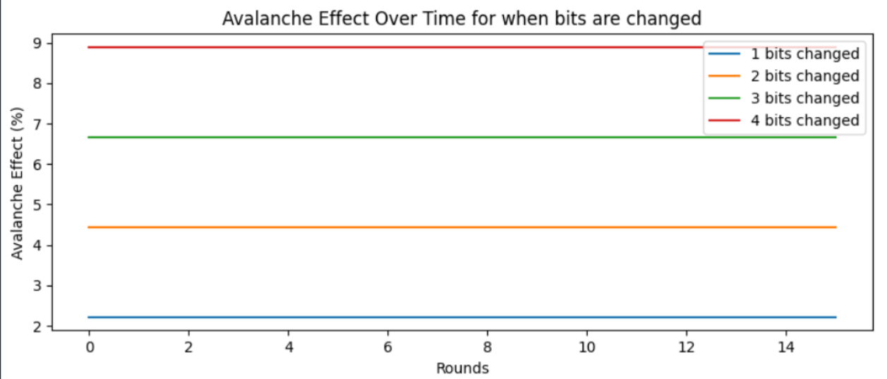
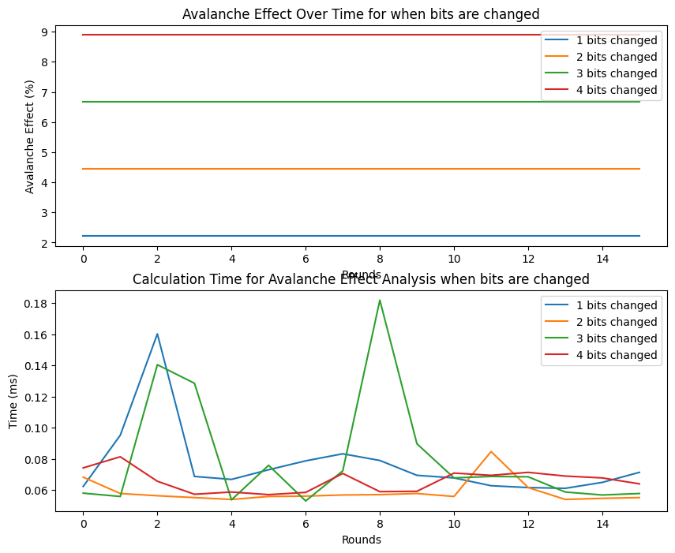
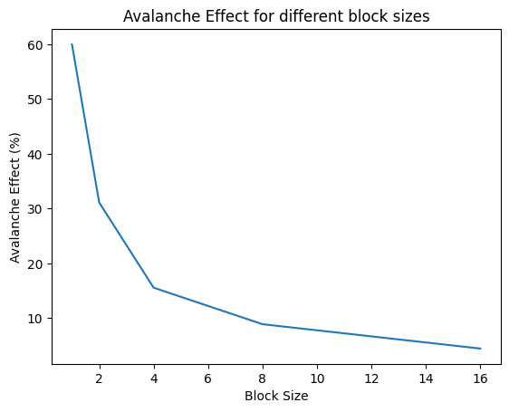

# DAT510: Assingment 1

[TOC]

## Abstract

It is well known that cryptography, ciphers, and encryption techniques have matured and strengthened over time. With the advent of computers, classical encryption techniques have faded out due to huge increases in computation power and strong analytic tools.  Cryptographic techniques have improved and moved over to using block and stream ciphering methods. An important part of ciphers that strengthens them is the properties of the avalanche effect. The avalanche effect measures the amount of change a cipher undergoes when a single bit is changed. If changing a single bit results in a ~50% change in the resulting cipher text it is considered good. An avalanche effect that is too low or too predictable may reveal certain patterns in the encryption algorithm, potentially making it vulnerable to attacks. Older classical encryption techniques like the Caesar cipher or transposition ciphers are generally extremely vulnerable to those types of attacks and can be cracked in seconds. Newer ciphers like AES (Advanced Encryption Standard) have been designed with this property in mind, ensuring proper  security and efficiency against modern analytic techniques.


## 1. Introduction
The main goal of this project is to implement different forms of classical and modern encryption methods. These encryption methods should then show how the avalanche effect differs between them. They should server as practical examples of how more advanced encryption methods use the avalanche effect to increase the security and robustness of the ciphers.

Classical encryption methods mainly use different variations of substitution and/or transposition ciphers. Substitution ciphers work by replacing letters, while transposition ciphers reorder them. There are multiple types of substitution ciphers [1](#1). There are simple ones like the Caesar cipher, which shifts the alphabet by a fixed amount, or more advanced polyalphabetic ciphers like the Vigenere cipher or some mechanical-based rotor machines. Rotor machines might also use mechanical configurations of alphabets instead [2](#2) [3](#3). These use multiple alphabets to replace the plaintext, which increases security by breaking up the frequency patterns. 

Transposition ciphers encrypt the text by rearranging the letters in a specific order. A columnar transposition cipher reads the letters in a matrix row by row, then reads them out column by column, in the order specified by a key [4](#4). The strength of the cipher generally depends on the key and length of the plaintext. A short message is quickly decrypted by brute force or other frequency analysis techniques, while the longer the message the harder it is to break given the right conditions [5](#5).

Encryption algorithms must have avalanche properties to be secure. Common properties are following the Strict avalanche Criterion (SAC) and the Bit Independence Criterion (BIC). The SAC formalizes a criterion of how the amount that any change in the input affects output. A consistent change of 50% is considered the best as it maximizes the confusion and diffusion properties, making it more resistant to certain attacks [6](#6) [8](#8). You want a small change to result in a large change in the result. However, too great of a change can also reveal weaknesses in the cipher and can be used to deduce the key. Following the BIC criterion means that the output bits not only change but change statistically independently of each other [7](#7). This way it should completely remove any patterns from the plaintext in the ciphertext.

Block cipher like DES and AES 

## 2. Design and Implementation
In our case, we will implement and combine a simple Caesar cipher and a columnar transposition cipher. The ceasar cipher only adds confusion to the cipher, and columnar transposition only diffusion. By combining them, we aim to increase the security by applying the properties required by the SAC and BIC.

### 2.1. Apply Encryption

The Caesar cipher implementation creates a simple character map based on the shift key. It creates a dictionary where the key is the original alphabet letter, and the value is the shifted letter. The `chr()` function is used to create the character from the numerical ASCII representation. To help standardise and increase security all string were converted to uppercase and spaces and other special characters were removed. The range of `A-Z` in a ASCII uppercase are the numbers 65 - 90. To create the caracter map 65 is used as the base, then the shift is used in combination with the index to map to the correct character. Due to the fact that the alphabet gets shifted. The last x number of keys will go past `Z`. To loop back around and continue with `A`, modulo is used to always just get the remainder whis is then added to the base. When used on a text, it loops through each character and for each letter, looks it up in the character map and replaces it with that value.

```
PROCEDURE CAESAR(plaintext, shift):
    character_map = {}
    FOR i = 0 to 25:
        character_map[chr(i + 65)] = chr((i + shift) % 26 + 65)
    END FOR

    ciphertext = ""
    FOR each character in plaintext:
        ciphertext += character_map[character]
    END FOR
    RETURN ciphertext
```

The columnar transposition cipher on ther hand is a bit more complicated. It requires several steps. The key needs to be split into a list of individual characters. A matrix is generated based on the number of rows and columns from the plaintext. If the plaintext is not a multiple of the key, it is padded with "X". The matrix is transposed to swap the rows and columns. The matrix is then read out again row by row, but this time it has dimensions `m x n` instead of `n x m`. The key determines the order of the columns. The index of the key is used to determine the order of the columns. The index is then used to read out the columns in the correct order. The result is then concatenated to form the ciphertext.

```
PROCEDURE COLUMNAR(plaintext, key):
    kl = [] # The key split into a list of individual characters
    cols = len(kl)
    rows = ceil(plaintext) / len(cols) 

    # If the plaintext is not a multiple of the key, pad with "X"
    text = plaintext + "X" * (rows * cols - len(plaintext))

    # Create a matrix from the text with dimensions rows x cols
    matrix = []
    FOR i = 0 to rows:
        matrix.append(text[i * cols : (i + 1) * cols])
    END FOR

    # Transpose the matrix then read it out row by row
    matrix = matrix.T

    ciphertext = ""
    FOR i = 1 to cols:
        key_index = kl.index(key[i])
        ciphertext += matrix[key_index][:]
    END FOR
    RETURN ciphertext
```

The order these ciphers are applied is important due to the fact that they bring different properties to the table. The Caesar cipher adds confusion, while the columnar transposition adds diffusion. The order of operations should be the substitution cipher first, and then the transposition cipher [9](#9). This ordering is due to the fact that confusion removes the recognizable elements from the plaintext and, in some cases, also attempts to disrupt recognizable patterns. Diffusion can then be used to ensure a proper reshuffling to prevent detectable patterns.

The keys and plaintext:

| Type              | Value                                              |
|-------------------|----------------------------------------------------|
| Plaintext         | Erik Martin Security and Vulnerability in Networks |
| Transposition key | 31425                                              |
| Substitution key  | 5                                                  |

#### Caesar cipher
The plaintext "Erik Martin Security and Vulnerability in Networks" is first preprocessed which converts it all to uppercase and removed identifying special characters. The result being "ERIKMARTINSECURITYANDVULNERABILITYINNETWORKS". This is then passed to the `caesar()` funciton along with the substitution key. The function then generates a letter map: `{'A': 'F', 'B': 'G', ..., 'Z': 'E'}`. It then loops over each plaintext letter and looks it up in the letter map.

| Number | Plain | Cipher |
| ------ | ----- | ------ |
| 1      | E     | J      |
| 2      | R     | W      |
| 3      | I     | N      |
| ...    | ...   | ...    |
| 44     | S     | X      |

Afterwards it merges it into a string and the result is "JWNPRFWYNSXJHZWNYDFSIAZQSJWFGNQNYDNSSJYBTWPX". 

#### Columnar transposition
The next step is substitution using columnar transposition. The cipher text is passed along to the columnar() function along with the transposition key. This key is converted to a list of int `[3, 1, 4, 2, 5]`. The amount of columns are `5` due to the length of the key, and number of rows is 
$$
cols = len(key) = 5
$$
$$
rows = \lceil\frac{len(plaintext)}{len(key)}\rceil = \lceil\frac{44}{5}\rceil = \lceil8.8\rceil = 9
$$

The plaintext is then padded with "X" until it is the multiple or `rows*cols` and it becomes "JWNPRFWYNSXJHZWNYDFSIAZQSJWFGNQNYDNSSJYBTWPXX". This is then entered into a numpy matrix and transposed, becomming:

##### Example of transposed matrix
| |1|2|3|4|5|6|7|8|9|
|-|-|-|-|-|-|-|-|-|-|
|3|J|F|X|N|I|J|Q|S|T|
|1|W|W|J|Y|A|W|N|S|W|
|4|N|Y|H|D|Z|F|Y|J|P|
|2|P|N|Z|F|Q|G|D|Y|X|
|5|R|S|W|S|S|N|N|B|X|
> The key is `[3, 1, 4, 2, 5]`, so the rows it chooses the rows in this order and merges the result into a string. 

The rows are extraccted in the order of the key and the result is "WWJYAWNSWPNZFQGDYXJFXNIJQSTNYHDZFYJPRSWSSNNBXX". This is the completed cipher text.

#### Decryption
Does this process in reverse. It takes the ciphertext and puts it back into the [transposed matrix](#example-of-transposed-matrix). Since the rows have been shuffled, we have to un-shuffle. This means looking at the key and putting, for instance, row 3 into row 1, row 2 into row 4 and so on. `decrypt()` does this by creating a temporary matrix, which it just fill up in the correct order. Afterwards, the matrix is transposed back and extracted row by row. This returns us with "JWNPRFWYNSXJHZWNYDFSIAZQSJWFGNQNYDNSSJYBTWPXX" which is the same as the result of the `caesar()` function, with the exception of an additional padding character at the end. To reverse the substitution the key passed to `caesar()` is just the key subtracted from the total number of values in the used alphabet

$$
decryption\_key = len(alphabet) - key = 26 - 5 = 21
$$

After applying the substitution again with the new key. The result is "ERIKMARTINSECURITYANDVULNERABILITYINNETWORKSS". The additional "S" at the end is the result of the padding. To be able to remove the padding at the end, a special padding character can be used. In systems where the result has to be exact and cannot be manually removed, any repeating character that usually isn't in repeating sequences like "X" can be used, but has to be handled by the authentication system.

### 2.2. Evaluate the Avalanche Effect
The avalanche effect is the percentage of bits that change in the output for making a small change in the input. For instance encrypting two versions of the, mostly, same plaintext:

| Text                                         | Cipher                       |
|----------------------------------------------|------------------------------|
|`ERIKMARTINSECURITYANDVULNERABILITYINNETWORKS`|`WWJYAWNSWPNZFQGDYXJFXNIJQSTNYHDZFYJPRSWSSNNBX`
|`RRIKMARTINSECURITYANDVULNERABILITYINNETWORKS`|`WWJYAWNSWPNZFQGDYXWFXNIJQSTNYHDZFYJPRSWSSNNBX`
> The difference is character 19: `J -> W`

The difference is difficult to find since they only have 1 character difference. This shows a negligable avalanche effect of $\approx$ 2%, since the number of differing bits is 
$$
Avalanch\ effect = \frac{num\ changed\ bits}{total\ number\ of\ bits} * 100 = \frac{1}{45} * 100 \approx 2.22\%
$$

2 percent is just one character difference, meaning that there is no avalanche effect. A change of one character doesn't cascade and change more bits. It just changes that one letter of the in the cipher text. 

### 2.3. Analyze the Avalanche effect

Additional rounds make no difference an terms of avalanche effect. Whenever the original and changed texts are re-encrypted the resulting avalanche effect is 2%, which means no avalanching. This comes down to how the transposition and substitution cipher works. The transposition rearranges and the substitution changes, but none of the characters depend on each other. If character number 1 is changed, the change cannot inflict any change on the different characters. The Caesar cipher only shifts a character based on a map and transposition rearranges the text, but character 1 is never part of deciding what, for instance, character 2 becomes. This is a big flaw in the way the methods act together, there is no confusion applied to the resulting cipher text. No matter how many times columnar or Caesar cipher is used, there will not be any resulting avalanche effect. 



> number of bits changes over consecutive rounds vs shows avalanche effect.

Even increasing the change from 1 bit to 4 bits and running it through the same pipeline does increase the percentage, but only by a predictable factor of the same number. There is no cascading change in bits, only the the number that were manually changed.
$$
Avalanche\ effect = n * (\frac{num\ changed\ bits}{total\ number\ of\ bits} * 100) \approx n * 2.22
$$
This again leads us to the same conclusion that the lack of dependency between the character leads to no avalanche effect property on the cipher.

### 2.4. Optimize Avalanche Effect with Reasonable Computation




### 2.5. Enhance Security with Block Ciphers



## 3. Discussion


## 4. Conclusion
The effect of change that the combination of Caesar cipher and Columnar transposition cipher offered alone was little when compared with the inclusion of the CBC block ciphering method. As the ciphertext is generated, the Caesar substitution method acts independently on each character. Due to a lack of "interaction" between the characters during the substitution stage, similar plaintext's will create similar looking cipher texts. Columnar transposition might add some diffusion, but it is not very complex and it only reorders the characters. The combination of them does not apply confusion and diffusion to a satisfactory standard. The application of CBC, however does improve the result.

## References

[github](https://github.com/eemrds/DAT510_2024/)

1. Substitution types: <a id="1" href="https://en.wikipedia.org/wiki/Substitution_cipher#Types">https://en.wikipedia.org/wiki/Substitution_cipher#Types</a>
2. Polyalphabetic substitution :<a id="2" href="https://en.wikipedia.org/wiki/Substitution_cipher#Polyalphabetic">https://en.wikipedia.org/wiki/Substitution_cipher#Polyalphabetic</a>
3. Mechanical substitution:<a id="3" href="https://en.wikipedia.org/wiki/Substitution_cipher#Mechanical">https://en.wikipedia.org/wiki/Substitution_cipher#Mechanical</a>
4. Columnar transposition:<a id="4" href="http://practicalcryptography.com/ciphers/columnar-transposition-cipher/#example">http://practicalcryptography.com/ciphers/columnar-transposition-cipher/#example</a>
5. Transposition Cipher:<a id="5" href="https://en.wikipedia.org/wiki/Transposition_cipher#General_principle">https://en.wikipedia.org/wiki/Transposition_cipher#General_principle</a>
6. Strict avalanche Criterion:<a id="6" href="https://en.wikipedia.org/wiki/Avalanche_effect#Strict_avalanche_criterion">https://en.wikipedia.org/wiki/Avalanche_effect#Strict_avalanche_criterion</a>
7. Bit Independence criterion:<a id="7" href="https://en.wikipedia.org/wiki/Avalanche_effect#Bit_independence_criterion">https://en.wikipedia.org/wiki/Avalanche_effect#Bit_independence_criterion</a>
8. Confusion and Diffusion:<a id="8" href="https://en.wikipedia.org/wiki/Confusion_and_diffusion">https://en.wikipedia.org/wiki/Confusion_and_diffusion</a>
9. 3 Classical:<a id="9" href="https://stavanger.instructure.com/courses/14643/files/folder/Lecture%20Slides?preview=1722525">https://stavanger.instructure.com/courses/14643/files/folder/Lecture%20Slides?preview=1722525</a>
10. CBC Mode:<a id="10" href="https://en.wikipedia.org/wiki/Block_cipher_mode_of_operation#Cipher_block_chaining_(CBC)">https://en.wikipedia.org/wiki/Block_cipher_mode_of_operation#Cipher_block_chaining_(CBC)</a>
11. Confusion and Diffusion:<a id="11" href="">
12. Confusion and Diffusion:<a id="12" href="">
13. Confusion and Diffusion:<a id="13" href="">
14. Confusion and Diffusion:<a id="14" href="">
15. Confusion and Diffusion:<a id="15" href="">
16. Confusion and Diffusion:<a id="16" href="">
17. Confusion and Diffusion:<a id="17" href="">